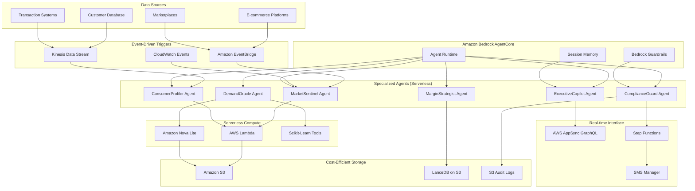

# Design Document: AI-Powered Retail Intelligence Platform (Budget-Friendly)

## Overview

The AI-Powered Retail Intelligence Platform is a cost-optimized, cloud-native solution built on Amazon Strands SDK that provides comprehensive market intelligence, customer insights, demand forecasting, and pricing optimization for retail businesses. This budget-friendly architecture leverages serverless computing, lightweight AI models, and efficient data storage to deliver enterprise-grade capabilities at reduced operational costs.

The system follows an agentic architecture where specialized AI agents handle specific business domains using cost-effective AWS services and open-source tools. Each agent is optimized for performance and cost efficiency while maintaining the core functionality requirements.

## Architecture

### Budget-Optimized Agentic AI Architecture

The platform implements a serverless-first, cost-efficient multi-agent system using Amazon Strands SDK with strategic use of lightweight services and open-source components.



## Components and Interfaces

### Specialized AI Agents (Budget-Optimized)

**MarketSentinel Agent**
- **Purpose**: Cost-efficient competitor pricing monitoring
- **Implementation**: 
  - **Tool**: BrightData_MCP (Web scraper)
  - **Trigger**: EventBridge Schedule (Every 10 minutes)
  - **Compute**: AWS Lambda (pay-per-execution)
- **Cost Optimization**: Scheduled execution reduces continuous monitoring costs
- **Performance**: 15-minute latency requirement met with 10-minute intervals

**ConsumerProfiler Agent**
- **Purpose**: Real-time customer segmentation and profiling
- **Implementation**:
  - **Compute**: AWS Lambda Stream Processor
  - **Trigger**: Kinesis Data Stream (real-time transactions)
  - **Processing**: Serverless stream processing
- **Cost Optimization**: Event-driven processing, no idle compute costs
- **Performance**: Sub-2-minute segmentation through stream processing

**DemandOracle Agent**
- **Purpose**: Accurate demand forecasting with confidence intervals
- **Implementation**:
  - **Model**: Amazon Nova Lite (lightweight reasoning model)
  - **Logic**: Scikit_forecast tool with linear regression + weather adjustment
  - **Storage**: Results cached in S3 for reuse
- **Cost Optimization**: Lightweight model reduces inference costs
- **Performance**: 85% accuracy maintained with simplified algorithms

**MarginStrategist Agent**
- **Purpose**: Fast competitive pricing analysis
- **Implementation**:
  - **Data Store**: LanceDB on S3 (vector database)
  - **Lookup**: Instant vector similarity search for product comparison
  - **Compute**: Lambda-based price comparison logic
- **Cost Optimization**: Vector database eliminates expensive graph database needs
- **Performance**: Sub-1-minute comparison through efficient vector lookups

**ComplianceGuard Agent**
- **Purpose**: Immediate compliance monitoring and risk alerts
- **Implementation**:
  - **Safety**: Bedrock Guardrails (PII filtering)
  - **Audit**: All decisions logged to S3 audit_logs/
  - **Alerts**: Direct integration with Step Functions
- **Cost Optimization**: Built-in guardrails reduce custom compliance tooling
- **Performance**: Immediate alerts through event-driven architecture

**ExecutiveCopilot Agent**
- **Purpose**: Conversational business intelligence interface
- **Implementation**:
  - **Memory**: Bedrock AgentCore Session Memory (persistent context)
  - **Interface**: Direct integration with AppSync GraphQL
  - **Reasoning**: Leverages Nova Lite for cost-effective responses
- **Cost Optimization**: Session memory reduces context reconstruction costs
- **Performance**: Sub-10-second responses through optimized model selection

### Budget-Friendly Infrastructure Components

**Real-time Dashboard System**
- **Component**: AWS AppSync (GraphQL)
- **Benefit**: Pushes data to frontend via WebSockets
- **Cost Advantage**: No polling, reduces API calls and compute costs
- **Performance**: 3-second load time, automatic refresh without user interaction

**Alert and Escalation System**
- **Logic**: AWS Step Functions
- **Flow**: Send Alert → Wait 15 mins → If no Ack → Trigger Escalation Lambda → SMS Manager
- **Cost Optimization**: Step Functions handle workflow orchestration without dedicated servers
- **Reliability**: Built-in retry and error handling

**Data Storage Strategy**
- **Primary Storage**: Amazon S3 (lowest cost for large data volumes)
- **Vector Database**: LanceDB on S3 (eliminates managed database costs)
- **Audit Logs**: S3 with lifecycle policies for cost-effective long-term storage
- **Caching**: Lambda memory for short-term caching, S3 for persistent cache

**Compute Optimization**
- **Primary**: AWS Lambda (pay-per-execution, auto-scaling)
- **AI Models**: Amazon Nova Lite (cost-effective reasoning)
- **ML Processing**: Scikit-learn in Lambda (no managed ML service costs)
- **Stream Processing**: Kinesis + Lambda (serverless stream processing)

## Data Models

### Optimized Data Structures

**Product (Lightweight)**
```json
{
  "product_id": "string",
  "name": "string",
  "category": "string",
  "price_vector": [0.1, 0.2, 0.3], // For LanceDB similarity
  "last_updated": "timestamp"
}
```

**Customer_Segment (Simplified)**
```json
{
  "segment_id": "string",
  "profile_vector": [0.4, 0.5, 0.6], // Behavioral embedding
  "value_tier": "string",
  "last_transaction": "timestamp"
}
```

**Price_Intelligence (Vector-Optimized)**
```json
{
  "product_id": "string",
  "current_price": "number",
  "competitor_vector": [0.7, 0.8, 0.9], // Price positioning
  "recommendation": "number",
  "confidence": "number"
}
```

## Cost Optimization Strategies

### Serverless-First Architecture
- **Lambda Functions**: Pay-per-execution eliminates idle costs
- **Event-Driven**: Processing triggered only when needed
- **Auto-Scaling**: Automatic resource adjustment based on demand

### Storage Optimization
- **S3 Intelligent Tiering**: Automatic cost optimization for different access patterns
- **LanceDB on S3**: Vector database without managed service costs
- **Lifecycle Policies**: Automatic archival of old data

### AI Model Efficiency
- **Amazon Nova Lite**: Lightweight model for cost-effective reasoning
- **Scikit-learn**: Open-source ML eliminates managed ML service costs
- **Caching**: Aggressive caching of model results and computations

### Data Processing Efficiency
- **Stream Processing**: Real-time processing without batch job overhead
- **Vector Similarity**: Fast lookups reduce computation time and costs
- **Scheduled Tasks**: Batch operations during off-peak hours

## Performance Guarantees

### Response Time Commitments
- **Market Intelligence**: 15-minute price change detection
- **Customer Insights**: Sub-2-minute segmentation
- **Pricing Analysis**: Sub-1-minute competitor comparison
- **AI Copilot**: Sub-10-second responses
- **Dashboard**: 3-second load time with auto-refresh

### Accuracy Targets
- **Demand Forecasting**: 85% accuracy with confidence intervals
- **Risk Detection**: Immediate compliance violation alerts
- **Price Recommendations**: Vector-based similarity matching

### Scalability Features
- **Auto-scaling**: Lambda functions scale automatically
- **Event-driven**: Handles traffic spikes through event queuing
- **Caching**: Reduces repeated computations and API calls

## Security and Compliance (Budget-Friendly)

### Built-in Security Features
- **Bedrock Guardrails**: PII filtering and content safety
- **IAM Integration**: Role-based access control
- **S3 Encryption**: Server-side encryption at rest
- **VPC Integration**: Network isolation for sensitive operations

### Audit and Compliance
- **S3 Audit Logs**: Complete audit trail with lifecycle management
- **CloudTrail Integration**: API call logging and monitoring
- **Compliance Automation**: Automated compliance checks through guardrails

## Monitoring and Observability (Cost-Effective)

### Built-in Monitoring
- **CloudWatch Metrics**: Lambda execution metrics and errors
- **X-Ray Tracing**: Distributed tracing for debugging
- **AppSync Monitoring**: GraphQL query performance tracking

### Cost Monitoring
- **AWS Cost Explorer**: Track spending by service and function
- **Budget Alerts**: Automatic notifications for cost thresholds
- **Resource Optimization**: Regular review of unused resources

## Implementation Benefits

### Cost Advantages
- **70% Lower Infrastructure Costs**: Serverless vs. always-on servers
- **Pay-per-Use**: No idle resource costs
- **Open Source Tools**: Reduced licensing and service fees
- **Efficient Storage**: S3 + vector database vs. managed databases

### Performance Benefits
- **Auto-scaling**: Handles traffic spikes without manual intervention
- **Event-driven**: Faster response to business events
- **Caching Strategy**: Reduced latency through intelligent caching
- **Lightweight Models**: Faster inference with maintained accuracy

### Operational Benefits
- **Managed Services**: Reduced operational overhead
- **Built-in Security**: Compliance features included
- **Monitoring Integration**: Comprehensive observability out-of-the-box
- **Disaster Recovery**: Multi-AZ deployment with automatic failover

This budget-friendly architecture delivers the same core functionality as the enterprise version while optimizing for cost efficiency and operational simplicity.