# Design Document: AI-Powered Retail Intelligence Platform

## Overview

The AI-Powered Retail Intelligence Platform is a cloud-native, agentic AI system built on Amazon Strands SDK that provides comprehensive market intelligence, customer insights, demand forecasting, and pricing optimization for retail businesses. The platform leverages specialized AI agents working collaboratively through the "Agents as Tools" pattern, deployed on Amazon Bedrock AgentCore for enterprise-scale operations.

The system follows an agentic architecture where specialized AI agents handle specific business domains (market intelligence, customer analysis, forecasting, pricing, risk assessment) and coordinate through an orchestrator agent. Each agent uses the latest Strands SDK function calling patterns with @tool decorators, custom tool schemas, and bidirectional streaming capabilities. This design ensures autonomous decision-making, resilient operations, and dynamic adaptation to changing business conditions.

## Architecture

### Agentic AI Architecture with Strands SDK

The platform implements a multi-agent system using Amazon Strands SDK, where specialized AI agents collaborate to deliver comprehensive retail intelligence. The architecture follows the "Agents as Tools" pattern, enabling dynamic orchestration and autonomous decision-making.

```mermaid
graph TB
    subgraph "External Data Sources"
        EXT1[E-commerce Platforms]
        EXT2[Marketplaces]
        EXT3[Industry Reports]
        EXT4[Economic Indicators]
    end
    
    subgraph "Internal Data Sources"
        INT1[Customer Database]
        INT2[Transaction Systems]
        INT3[Inventory Management]
        INT4[CRM Systems]
    end
    
    subgraph "Amazon Bedrock AgentCore"
        RUNTIME[Agent Runtime]
        MEMORY[Persistent Memory]
        IDENTITY[Identity & Auth]
        OBSERVABILITY[Observability]
    end
    
    subgraph "Orchestrator Agent Layer"
        ORCHESTRATOR[Retail Intelligence Orchestrator Agent]
    end
    
    subgraph "Specialized Agent Layer"
        MARKET_AGENT[Market Intelligence Agent]
        CUSTOMER_AGENT[Customer Insights Agent]
        FORECAST_AGENT[Demand Forecasting Agent]
        PRICING_AGENT[Pricing Intelligence Agent]
        RISK_AGENT[Risk Analysis Agent]
        COPILOT_AGENT[AI Copilot Agent]
    end
    
    subgraph "Tool Layer (Strands SDK)"
        DATA_TOOLS[Data Ingestion Tools]
        ANALYTICS_TOOLS[Analytics Tools]
        ML_TOOLS[ML Inference Tools]
        NOTIFICATION_TOOLS[Notification Tools]
        INTEGRATION_TOOLS[Integration Tools]
    end
    
    subgraph "AWS Infrastructure"
        S3[Amazon S3]
        BEDROCK[Amazon Bedrock]
        LAMBDA[AWS Lambda]
        KINESIS[Amazon Kinesis]
        RDS[Amazon RDS]
        OPENSEARCH[Amazon OpenSearch]
    end
    
    subgraph "Client Interfaces"
        WEB[Web Dashboard]
        API[REST API]
        STREAMING[WebSocket Streaming]
    end
    
    EXT1 --> DATA_TOOLS
    EXT2 --> DATA_TOOLS
    EXT3 --> DATA_TOOLS
    EXT4 --> DATA_TOOLS
    
    INT1 --> DATA_TOOLS
    INT2 --> DATA_TOOLS
    INT3 --> DATA_TOOLS
    INT4 --> DATA_TOOLS
    
    RUNTIME --> ORCHESTRATOR
    MEMORY --> ORCHESTRATOR
    IDENTITY --> ORCHESTRATOR
    OBSERVABILITY --> ORCHESTRATOR
    
    ORCHESTRATOR --> MARKET_AGENT
    ORCHESTRATOR --> CUSTOMER_AGENT
    ORCHESTRATOR --> FORECAST_AGENT
    ORCHESTRATOR --> PRICING_AGENT
    ORCHESTRATOR --> RISK_AGENT
    ORCHESTRATOR --> COPILOT_AGENT
    
    MARKET_AGENT --> DATA_TOOLS
    MARKET_AGENT --> ANALYTICS_TOOLS
    CUSTOMER_AGENT --> ANALYTICS_TOOLS
    CUSTOMER_AGENT --> ML_TOOLS
    FORECAST_AGENT --> ML_TOOLS
    PRICING_AGENT --> ML_TOOLS
    PRICING_AGENT --> ANALYTICS_TOOLS
    RISK_AGENT --> ANALYTICS_TOOLS
    RISK_AGENT --> NOTIFICATION_TOOLS
    COPILOT_AGENT --> INTEGRATION_TOOLS
    
    DATA_TOOLS --> S3
    DATA_TOOLS --> KINESIS
    ANALYTICS_TOOLS --> RDS
    ANALYTICS_TOOLS --> OPENSEARCH
    ML_TOOLS --> BEDROCK
    ML_TOOLS --> LAMBDA
    NOTIFICATION_TOOLS --> LAMBDA
    INTEGRATION_TOOLS --> LAMBDA
    
    ORCHESTRATOR --> WEB
    ORCHESTRATOR --> API
    ORCHESTRATOR --> STREAMING
```



### Agent Architecture Patterns

**Orchestrator Agent Pattern**: The main Retail Intelligence Orchestrator Agent coordinates all specialized agents, manages conversation context, and provides unified responses to client requests.

**Agents as Tools Pattern**: Each specialized agent is wrapped as a callable tool using Strands SDK @tool decorator, enabling seamless inter-agent communication and dynamic orchestration.

**Bidirectional Streaming**: Real-time communication between agents and clients using WebSocket connections for live updates and interactive conversations.

**Persistent Memory**: Amazon Bedrock AgentCore provides persistent memory across agent interactions, maintaining context and learning from user preferences.

## Components and Interfaces

### Specialized AI Agents Architecture

**Retail Intelligence Orchestrator Agent**
- **Purpose**: Central coordinator that manages all specialized agents and synthesizes outputs
- **Capabilities**: Task delegation, context management, response synthesis, conversation orchestration
- **Tools**: Access to all specialized agents as callable tools using Strands SDK @tool pattern
- **Interface**: Primary entry point for all client interactions via REST API and WebSocket streaming
- **Memory**: Persistent conversation context and user preferences via Amazon Bedrock AgentCore

**Market Intelligence Agent**
- **Purpose**: Competitor analysis, pricing monitoring, and market trend identification
- **Capabilities**: 
  - Autonomous competitor pricing monitoring across e-commerce platforms and marketplaces
  - Real-time price change detection with 15-minute latency for critical products
  - Promotional pattern analysis and seasonal trend identification
  - Competitive positioning analysis with market share estimation
- **Tools**: Web scraping tools, data analysis tools, alert generation tools
- **Data Sources**: E-commerce APIs, marketplace feeds, industry reports
- **Interface**: Callable as tool by orchestrator agent, direct API access for batch operations

**Customer Insights Agent**
- **Purpose**: Customer behavior analysis, segmentation, and lifetime value calculation
- **Capabilities**:
  - Behavioral customer segmentation within 2-minute processing time
  - Real-time customer profile updates from interaction events
  - Customer lifetime value, purchase frequency, and seasonal pattern tracking
  - Actionable recommendation generation for customer segments
- **Tools**: ML segmentation tools, analytics tools, recommendation engines
- **Data Sources**: Customer database, transaction systems, CRM data
- **Interface**: Streaming updates via Kinesis, batch analysis via scheduled jobs

**Demand Forecasting Agent**
- **Purpose**: Predictive analytics for inventory management and demand planning
- **Capabilities**:
  - Multi-horizon forecasting (daily, weekly, monthly, quarterly) with confidence intervals
  - Seasonal pattern detection and integration
  - External factor adaptation (weather, events, trends)
  - 85%+ forecast accuracy for established products
- **Tools**: Time series analysis tools, ML forecasting models, optimization algorithms
- **Data Sources**: Historical sales data, external factor feeds, inventory systems
- **Interface**: Forecast API endpoints, real-time model inference

**Pricing Intelligence Agent**
- **Purpose**: Dynamic pricing optimization and competitive pricing analysis
- **Capabilities**:
  - Sub-minute competitor price comparison
  - Price recommendation with impact analysis
  - Dynamic pricing strategy implementation across customer segments
  - Demand elasticity and profit margin consideration
- **Tools**: Pricing optimization algorithms, competitor monitoring tools, impact analysis models
- **Data Sources**: Market data, customer behavior data, financial systems
- **Interface**: Real-time pricing API, batch optimization jobs

**Risk Analysis Agent**
- **Purpose**: Business risk identification and compliance monitoring
- **Capabilities**:
  - Comprehensive risk identification across pricing, inventory, and market conditions
  - Real-time compliance violation detection and alerting
  - Risk threshold monitoring with automated escalation
  - Audit trail maintenance for all assessments
- **Tools**: Anomaly detection algorithms, compliance monitoring tools, alert systems
- **Data Sources**: All platform data sources, regulatory feeds, audit logs
- **Interface**: Real-time monitoring, alert webhooks, compliance reporting API

**AI Copilot Agent**
- **Purpose**: Conversational AI interface for business decision support
- **Capabilities**:
  - Sub-10-second response time for contextual insights
  - Decision support with pros/cons analysis and supporting data
  - Complex scenario simulation with probability estimates
  - Explainable AI with reasoning and source citations
- **Tools**: Natural language processing, decision analysis frameworks, explanation generators
- **Data Sources**: All platform insights and analyses
- **Interface**: WebSocket for real-time conversations, REST API for structured queries

### AWS Infrastructure Integration

**Amazon Bedrock AgentCore Services**
- **Agent Runtime**: Managed execution environment with auto-scaling and load balancing
- **Persistent Memory**: Cross-session context storage and user preference learning
- **Identity Integration**: AWS IAM and Cognito for secure authentication and authorization
- **Observability**: CloudWatch integration for comprehensive monitoring and logging
- **Security**: Enterprise-grade security with encryption at rest and in transit

**Data Storage Architecture**
- **Amazon S3**: 
  - Raw data storage with lifecycle policies
  - Model artifacts and analysis results storage
  - Cross-region replication for disaster recovery
- **Amazon RDS**: 
  - Structured customer and transaction data
  - ACID compliance for critical business data
  - Read replicas for analytics workloads
- **Amazon OpenSearch**: 
  - Full-text search and analytics
  - Real-time market intelligence indexing
  - Dashboard and visualization support

**Real-time Processing Infrastructure**
- **Amazon Kinesis**: 
  - Real-time data streaming with exactly-once processing
  - Customer interaction and transaction event processing
  - Integration with Lambda for stream processing
- **AWS Lambda**: 
  - Serverless tool execution for agents
  - Event-driven data processing
  - Auto-scaling based on demand

**ML and AI Services Integration**
- **Amazon Bedrock**: 
  - Foundation models for agent reasoning (Meta Llama 4, Claude, etc.)
  - Custom model fine-tuning and deployment
  - Multi-model inference with routing
- **Amazon SageMaker**: 
  - Custom ML model training for specialized use cases
  - Model registry and versioning
  - A/B testing infrastructure

**Client Integration Interfaces**
- **Amazon API Gateway**: 
  - RESTful API endpoints with rate limiting and caching
  - Authentication and authorization integration
  - Request/response transformation
- **AWS WebSocket API**: 
  - Real-time bidirectional streaming for agent conversations
  - Connection management and scaling
  - Message routing and delivery guarantees
- **Amazon EventBridge**: 
  - Event-driven communication between services
  - Custom event patterns and routing rules
  - Integration with external systems

## Data Models

### Core Entities

**Product**
```json
{
  "product_id": "string",
  "name": "string",
  "category": "string",
  "brand": "string",
  "attributes": {
    "color": "string",
    "size": "string",
    "weight": "number"
  },
  "created_at": "timestamp",
  "updated_at": "timestamp"
}
```

**Customer**
```json
{
  "customer_id": "string",
  "email": "string",
  "demographics": {
    "age_group": "string",
    "location": "string",
    "income_bracket": "string"
  },
  "preferences": {
    "categories": ["string"],
    "brands": ["string"],
    "price_sensitivity": "number"
  },
  "lifetime_value": "number",
  "created_at": "timestamp",
  "updated_at": "timestamp"
}
```

**Transaction**
```json
{
  "transaction_id": "string",
  "customer_id": "string",
  "items": [
    {
      "product_id": "string",
      "quantity": "number",
      "unit_price": "number",
      "discount": "number"
    }
  ],
  "total_amount": "number",
  "payment_method": "string",
  "channel": "string",
  "timestamp": "timestamp"
}
```

**Market_Data**
```json
{
  "data_id": "string",
  "source": "string",
  "product_id": "string",
  "competitor_id": "string",
  "price": "number",
  "availability": "boolean",
  "promotion_details": {
    "discount_percentage": "number",
    "promotion_type": "string",
    "start_date": "timestamp",
    "end_date": "timestamp"
  },
  "collected_at": "timestamp"
}
```

**Forecast**
```json
{
  "forecast_id": "string",
  "product_id": "string",
  "forecast_type": "string",
  "time_horizon": "string",
  "predictions": [
    {
      "date": "timestamp",
      "predicted_value": "number",
      "confidence_interval": {
        "lower": "number",
        "upper": "number"
      }
    }
  ],
  "model_version": "string",
  "created_at": "timestamp"
}
```

### Aggregated Data Models

**Customer_Segment**
```json
{
  "segment_id": "string",
  "name": "string",
  "description": "string",
  "criteria": {
    "demographic_filters": {},
    "behavioral_filters": {},
    "value_filters": {}
  },
  "customer_count": "number",
  "avg_lifetime_value": "number",
  "created_at": "timestamp"
}
```

**Price_Intelligence**
```json
{
  "intelligence_id": "string",
  "product_id": "string",
  "current_price": "number",
  "competitor_prices": [
    {
      "competitor_id": "string",
      "price": "number",
      "last_updated": "timestamp"
    }
  ],
  "price_position": "string",
  "recommended_price": "number",
  "expected_impact": {
    "revenue_change": "number",
    "volume_change": "number"
  },
  "generated_at": "timestamp"
}
```

**Risk_Assessment**
```json
{
  "assessment_id": "string",
  "risk_type": "string",
  "severity": "string",
  "description": "string",
  "affected_entities": ["string"],
  "probability": "number",
  "impact_score": "number",
  "mitigation_recommendations": ["string"],
  "created_at": "timestamp",
  "expires_at": "timestamp"
}
```

## Correctness Properties

*A property is a characteristic or behavior that should hold true across all valid executions of a system—essentially, a formal statement about what the system should do. Properties serve as the bridge between human-readable specifications and machine-verifiable correctness guarantees.*

Based on the requirements analysis, the following correctness properties ensure the platform operates according to its specifications:

### Data Ingestion and Processing Properties

**Property 1: Autonomous Price Monitoring**
*For any* specified product category and data source configuration, the platform should continuously monitor and collect competitor pricing data from all configured sources without manual intervention.
**Validates: Requirements 1.1**

**Property 2: Real-time Price Change Detection**
*For any* price change event on critical products, the platform should detect and process the change within 15 minutes of occurrence.
**Validates: Requirements 1.2**

**Property 3: Pattern Analysis Completeness**
*For any* historical pricing dataset, the platform should analyze and identify promotional patterns, discount strategies, and seasonal trends present in the data.
**Validates: Requirements 1.3**

**Property 4: Real-time Profile Updates**
*For any* customer interaction event, the platform should update the corresponding customer profile immediately upon receiving the event.
**Validates: Requirements 2.2**

**Property 5: Data Quality and Audit Trail Maintenance**
*For any* data integration operation, the platform should validate data quality, maintain complete audit trails, and preserve data lineage information.
**Validates: Requirements 9.2, 9.5, 5.5**

### Analytics and Intelligence Properties

**Property 6: Customer Segmentation Performance**
*For any* customer dataset, the intelligence engine should complete behavioral segmentation analysis within 2 minutes and produce meaningful customer segments.
**Validates: Requirements 2.1**

**Property 7: Competitive Positioning Analysis**
*For any* market data input, the platform should generate competitive positioning analysis that includes market share estimates and brand perception metrics.
**Validates: Requirements 1.4**

**Property 8: Customer Metrics Tracking**
*For any* customer with transaction history, the platform should accurately calculate and maintain customer lifetime value, purchase frequency, and seasonal patterns.
**Validates: Requirements 2.3**

**Property 9: Actionable Recommendations Generation**
*For any* identified customer segment, the platform should provide specific, actionable recommendations tailored to that segment's characteristics.
**Validates: Requirements 2.4**

### Forecasting Properties

**Property 10: Forecast Confidence Intervals**
*For any* demand forecast request, the forecast model should provide predictions that include confidence intervals for all predicted values.
**Validates: Requirements 3.1**

**Property 11: Multi-horizon Forecasting**
*For any* forecasting request, the platform should generate forecasts for all specified time horizons: daily, weekly, monthly, and quarterly.
**Validates: Requirements 3.2**

**Property 12: Seasonal Pattern Integration**
*For any* dataset containing seasonal patterns, the forecast model should incorporate detected seasonality into its predictions.
**Validates: Requirements 3.3**

**Property 13: External Factor Adaptation**
*For any* change in external factors (weather, events, trends), the platform should adjust existing forecasts to reflect the impact of these changes.
**Validates: Requirements 3.4**

**Property 14: Forecast Accuracy Threshold**
*For any* established product with sufficient historical data, the platform should achieve forecast accuracy of at least 85% when compared to actual outcomes.
**Validates: Requirements 3.5**

### Pricing Intelligence Properties

**Property 15: Pricing Analysis Performance**
*For any* pricing analysis request, the platform should complete competitor price comparison within 1 minute of the request.
**Validates: Requirements 4.1**

**Property 16: Comprehensive Pricing Recommendations**
*For any* pricing recommendation, the platform should consider demand elasticity, competitor positioning, and profit margins in its analysis.
**Validates: Requirements 4.3**

**Property 17: Price Change Impact Analysis**
*For any* market condition change, the platform should generate price adjustment recommendations that include expected impact analysis.
**Validates: Requirements 4.2**

**Property 18: Dynamic Pricing Strategy Support**
*For any* customer segment and sales channel combination, the platform should apply appropriate dynamic pricing strategies based on segment characteristics and channel requirements.
**Validates: Requirements 4.5**

### Risk Analysis and Alerting Properties

**Property 19: Comprehensive Risk Identification**
*For any* risk analysis operation, the risk analyzer should identify potential risks across all specified categories: pricing, inventory, and market conditions.
**Validates: Requirements 5.1**

**Property 20: Alert Generation and Delivery**
*For any* significant event (market events, compliance violations, threshold breaches), the platform should generate appropriate alerts and deliver them to relevant stakeholders within 1 minute.
**Validates: Requirements 1.5, 5.2, 5.4, 8.1**

**Property 21: Alert Content Completeness**
*For any* triggered alert, the platform should include context information and recommended actions in the alert content.
**Validates: Requirements 8.2**

**Property 22: Multi-channel Notification Support**
*For any* alert configuration, the platform should support delivery through all specified notification channels: email, SMS, and in-app notifications.
**Validates: Requirements 8.3**

**Property 23: Alert Escalation Management**
*For any* unacknowledged alert that meets escalation criteria, the system should escalate to appropriate management levels according to configured escalation rules.
**Validates: Requirements 8.4**

### AI Copilot Properties

**Property 24: AI Response Performance and Relevance**
*For any* user question, the AI copilot should provide relevant insights based on current data within 10 seconds.
**Validates: Requirements 6.1**

**Property 25: Decision Support Completeness**
*For any* decision support request, the platform should present both pros and cons with supporting data for the decision being considered.
**Validates: Requirements 6.2**

**Property 26: Scenario Simulation**
*For any* complex scenario presented to the platform, it should simulate multiple different outcomes and provide probability estimates for each outcome.
**Validates: Requirements 6.4**

**Property 27: AI Explainability**
*For any* AI-generated recommendation, the copilot should provide explanations of its reasoning and cite the data sources used in the analysis.
**Validates: Requirements 6.5**

### User Interface and Integration Properties

**Property 28: Dashboard Performance**
*For any* dashboard load request, the platform should display current data within 3 seconds of the request.
**Validates: Requirements 7.1**

**Property 29: Dashboard Customization**
*For any* user role and preference configuration, the platform should provide customizable dashboards that reflect the specified role requirements and user preferences.
**Validates: Requirements 7.3**

**Property 30: Trend Visualization**
*For any* significant trend in the data, the dashboard should highlight important changes with appropriate visual indicators.
**Validates: Requirements 7.4**

**Property 31: Multi-format Export Support**
*For any* report or visualization, the platform should support export in all specified formats: PDF, Excel, and PNG.
**Validates: Requirements 7.5**

**Property 32: Integration Method Support**
*For any* integration request, the platform should support all specified integration methods: REST APIs, webhooks, and batch file uploads.
**Validates: Requirements 9.1**

**Property 33: API Performance Standards**
*For any* standard API query, the platform should respond within 2 seconds of receiving the request.
**Validates: Requirements 9.4**

### Scalability and Performance Properties

**Property 34: Concurrent User Performance**
*For any* system load up to 1000 simultaneous users, the platform should maintain response times under 5 seconds for all operations.
**Validates: Requirements 10.1**

**Property 35: High-volume Data Processing**
*For any* daily data volume up to 10TB, the platform should process the data without performance degradation compared to baseline performance metrics.
**Validates: Requirements 10.2**

**Property 36: Auto-scaling Behavior**
*For any* change in system demand, the platform should automatically scale computing resources appropriately to maintain performance standards.
**Validates: Requirements 10.3**

**Property 37: Load Prioritization**
*For any* high system load condition, the platform should prioritize critical functions and queue non-urgent requests according to configured priority rules.
**Validates: Requirements 10.4**

## Error Handling

The platform implements comprehensive error handling across all layers:

### Data Layer Error Handling
- **Data Source Failures**: Automatic retry with exponential backoff, fallback to cached data
- **Schema Evolution**: Automatic schema detection and migration with backward compatibility
- **Data Quality Issues**: Quarantine invalid data, alert data stewards, continue processing valid records
- **Storage Failures**: Multi-region replication, automatic failover to secondary storage

### Processing Layer Error Handling
- **Pipeline Failures**: Checkpoint-based recovery, partial reprocessing from last successful state
- **Transformation Errors**: Skip invalid records with logging, continue batch processing
- **Resource Exhaustion**: Dynamic resource allocation, job queuing during peak loads
- **Timeout Handling**: Configurable timeouts per operation type, graceful degradation

### ML/AI Layer Error Handling
- **Model Serving Failures**: Circuit breaker pattern, fallback to previous model version
- **Inference Errors**: Default responses for invalid inputs, confidence score thresholds
- **Training Failures**: Automatic rollback to previous model, alert ML engineers
- **Resource Constraints**: Model serving prioritization, request queuing

### Application Layer Error Handling
- **Service Unavailability**: Health checks, automatic service restart, load balancer failover
- **Rate Limiting**: Graceful degradation, priority queuing for premium users
- **Authentication Failures**: Secure error messages, audit logging, account lockout protection
- **Data Inconsistency**: Eventual consistency patterns, conflict resolution strategies

### User Interface Error Handling
- **Network Failures**: Offline mode with local caching, automatic retry mechanisms
- **Session Expiry**: Seamless re-authentication, state preservation
- **Rendering Errors**: Fallback UI components, error boundary implementation
- **Export Failures**: Retry mechanisms, alternative format suggestions

## Testing Strategy

The platform employs a comprehensive dual testing approach combining unit tests for specific scenarios and property-based tests for universal correctness validation.

### Property-Based Testing

**Framework Selection**: The platform uses Hypothesis (Python) for property-based testing, configured to run a minimum of 100 iterations per property test to ensure comprehensive input coverage through randomization.

**Test Organization**: Each correctness property from the design document is implemented as a single property-based test, tagged with the format: **Feature: retail-intelligence-platform, Property {number}: {property_text}**

**Property Test Categories**:

1. **Data Processing Properties**: Test data ingestion, validation, and transformation across various input formats and volumes
2. **Analytics Properties**: Verify correctness of customer segmentation, forecasting, and pricing algorithms
3. **Performance Properties**: Validate response time requirements under varying load conditions
4. **Integration Properties**: Test API endpoints, data synchronization, and multi-format support
5. **AI/ML Properties**: Verify model inference, recommendation quality, and explainability

**Test Data Generation**: Property tests use sophisticated generators that create realistic retail data including:
- Product catalogs with hierarchical categories
- Customer profiles with diverse demographics and behaviors  
- Transaction histories with seasonal patterns
- Market data with competitive pricing scenarios
- Time series data with various trend and seasonality patterns

### Unit Testing

**Complementary Coverage**: Unit tests focus on specific examples, edge cases, and integration points that complement the broad coverage provided by property tests.

**Unit Test Categories**:

1. **Edge Case Testing**: Boundary conditions, empty datasets, malformed inputs
2. **Integration Testing**: Service-to-service communication, database connections, external API interactions
3. **Error Condition Testing**: Network failures, timeout scenarios, resource exhaustion
4. **Configuration Testing**: Different deployment environments, feature flag variations
5. **Security Testing**: Authentication, authorization, data encryption, input sanitization

**Test Environment**: Unit tests run in isolated environments with mocked external dependencies to ensure deterministic results and fast execution.

### Performance Testing

**Load Testing**: Automated performance tests validate scalability requirements using tools like Apache JMeter and K6 to simulate realistic user loads and data volumes.

**Stress Testing**: System behavior under extreme conditions including peak holiday traffic, large batch processing jobs, and resource constraints.

**Endurance Testing**: Long-running tests to identify memory leaks, resource accumulation, and performance degradation over time.

### Integration Testing

**End-to-End Testing**: Automated workflows that test complete business scenarios from data ingestion through insight generation and user notification.

**Contract Testing**: API contract validation using tools like Pact to ensure service compatibility across different versions and deployments.

**Data Pipeline Testing**: Validation of data flow through the entire pipeline including transformation accuracy, data quality checks, and lineage tracking.

### Monitoring and Observability

**Real-time Monitoring**: Comprehensive monitoring of system health, performance metrics, and business KPIs using tools like Prometheus, Grafana, and DataDog.

**Distributed Tracing**: Request tracing across microservices to identify bottlenecks and debug complex interactions using Jaeger or Zipkin.

**Log Aggregation**: Centralized logging with structured log formats for efficient searching and analysis using ELK stack or similar solutions.

**Alerting**: Proactive alerting based on system metrics, error rates, and business rule violations with escalation procedures for critical issues.